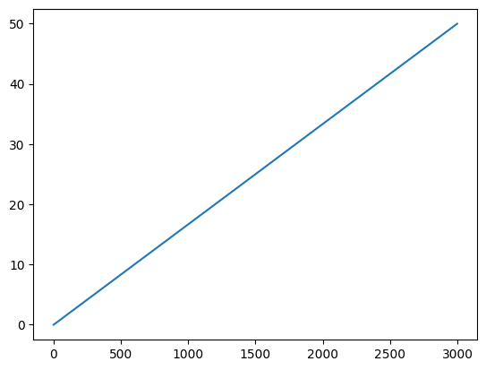

# The Originators

An NFT collection of The Originators with dynamic mint and burn pricing.


## Introduction

Loosely inspired by [shopping cart rental locks](https://lakevoicenews.org/quarter-for-a-cart-the-real-reason-you-need-a-quarter-for-your-shopping-cart-at-aldi-80fbe9233809), NFT “rentals” (or sales with the option to burn) can be made by depositing tokens and receiving your NFT. Dynamic pricing seems to be a natural supply and demand regulator as well as being a method of asset pricing.  Giving the users the ability to burn the tokens for tokens also give the users options for reasonable refunds, resulting in less of a chance of buyers remorse while also allowing the token supply to naturally reduce if demand is reduced.

The pricing model of this implementation will be linear but a [Sigmoid bonding curve](https://en.wikipedia.org/wiki/Sigmoid_function) is also compelling.  This should reward early investors while leveling out at a target price.  Another good option would be a quadratic curve which would favor a target max supply of the token.


```python
import math
import numpy as np
import matplotlib.pyplot as plt
```

## Pricing

Dynamic pricing will be done using a bonding curve (TOOD: Multiple options?).  Initially a Sigmoidal curve and quadratic curve seem like they would both be useful in different circumstances.


```python
max_supply = 3000
max_price_eth = 50
```

### Linear "Curve"

A linear curve is pretty straight forward and was chosend for this implementation for ease of implementation but is probably the least exciting option.


```python
fig = plt.figure()

curve_mod = 3

def curve(x):
    # plain linear pricing
    return x * (max_price_eth / max_supply)

def plot_points():
    """Plot x,y points for a sigmoidal curve for NFT pricing"""
    return [(x, curve(x)) for x in range(0, max_supply)]

points = [[x, y] for x, y in plot_points()]

ax = fig.add_subplot(1, 1, 1)
ax.plot([x for x, _ in points], [y for _, y in points], color='tab:blue')

plt.show()
```


    

    


### Sigmoidal Bonding Curve

A [sigmoidal](https://en.wikipedia.org/wiki/Sigmoid_function) bonding curve allows early adopters to be awarded with a lower price while ramping up to a maximum price before arriving at the max supply of the token.


```python
fig = plt.figure()

curve_mod = 3

def curve(x):
    # plain sigmoid: 1 / (1 + math.exp(-x))
    return max_price_eth - math.exp(-(x / (max_supply / 2)) ** curve_mod)

def plot_points():
    """Plot x,y points for a sigmoidal curve for NFT pricing"""
    return [(x, curve(x)) for x in range(0, max_supply)]

points = [[x, y] for x, y in plot_points()]

ax = fig.add_subplot(1, 1, 1)
ax.plot([x for x, _ in points], [y for _, y in points], color='tab:blue')

plt.show()
```


    

    


### Quadratic Bonding Curve

A [quadratic](https://en.wikipedia.org/wiki/Quadratic_function) curve is another option which would set the max supply by raising the price to be beyond a resonable range.


```python
fig = plt.figure()

curve_mod = 3
base_price = 0.1

def curve(x):
    # plain quadratic: a * x ^ 2 + b * x + c
    # TODO: Can this be simplified?
    return (1 / max_supply * (max_price_eth / max_supply)) * x ** 2 + base_price

def plot_points():
    """Plot x,y points for a quadratic curve for NFT pricing"""
    return [(x, curve(x)) for x in range(0, max_supply)]

points = plot_points()

ax = fig.add_subplot(1, 1, 1)
ax.plot([x for x, _ in points], [y for _, y in points], color='tab:blue')

plt.xlim(0, max_supply)
plt.ylim(0, max_price_eth)
plt.show()
```


    

    


## Burns

Burns are a way to reduce the supply naturally to balance the supply with a price point.  It's also a way for buyers to potentially get reasonable refunds if they decide later that the purchase was not worth it.

For instance, in the above quadratic graph, if the supply is currently at 1500 tokens, they would get a refund of about 10 ETH.
